# CodeQuest UI/UX redesign v2

Date: 2026-10-03. Production baseline inspected: `a1a6f0cc61757784ec8ef8f5fe2cbc39bd876775`.

Status: design proposal supported by an interactive prototype and browser evidence. No production application code, routes, dependencies, database or academic rules changed. Fixtures are examples, not real student results. Visual review supports a direction; it does not establish learning effectiveness or production accessibility certification.

**Selected direction: Learning Workshop.** Guide the learner through meaningful work on flat, readable pages. When they start coding, give their code a full-width tool surface with instructions alongside it and feedback beneath it. Course milestones orient the learner; they do not turn every screen into a game board.

Run `npm run prototype`, then open [the prototype](http://localhost:4173/v2-prototype.html?variant=synthesis&screen=dashboard). Use the screen selector and bottom direction switcher. Its URL includes `variant`, `screen`, and fixture `state`. No login or database is required.

## 1. UI UX Pro Max analysis

The installed project-local [SKILL.md](../../.agents/skills/ui-ux-pro-max/SKILL.md) was read before selecting the direction. Its workflow was followed: classify the product and stack, generate a hybrid recommendation, generate recommendations independently for A/B/C, inspect adjacent product categories, query focused concerns, inspect fit, then reconcile results with product research and CodeQuest authority.

CodeQuest is a hybrid of programming education, developer workspace, LMS, assessment, gamified progression and student evidence. Its audience needs concept explanation, safe experimentation, consequential submission and a clear next step. Its web implementation is Laravel/Blade, Tailwind v4 and CodeMirror 6. This is not a generic SaaS dashboard, children's game, native app, marketing landing page or full institutional exam suite.

Actual search commands and returned guidance are retained in [v2-skill-searches.txt](prototype/v2-skill-searches.txt). The tooling returned recommendations, not authoritative designs. The hybrid query was deliberately supplemented by focused category queries rather than used as the sole classifier.

| Query / source | Actual result | Decision |
| --- | --- | --- |
| `programming education developer LMS assessment gamified analytics --design-system` | FAQ/documentation landing; dark style | Reject landing composition. Retain readable technical surfaces as a candidate, not a mandate for all-dark pages. |
| `developer IDE compact dark --design-system` | FAQ/documentation landing; dark style | Evaluate as A, compact developer environment. Reject FAQ/search hero and marketing CTA. |
| `education learning content minimal --design-system` | Feature-rich showcase; claymorphism | Evaluate guided learning as B. Reject showcase layout and clay effects; use focused LMS category guidance instead. |
| `gamified education progression restrained --design-system` | Hero/features/CTA; Minimalism & Swiss Style | Evaluate C with flat typography-led milestone structure. Reject marketing section structure. |
| `developer IDE --domain product` | Developer Tool / IDE; dark + minimalism, adjacent API portal | Compact chrome and work hierarchy fit coding. A portal's documentation menu does not replace the learning route. |
| `education LMS --domain product` | LMS; flat, accessible; Educational App; clay/micro-interaction | Adopt flat accessible reading structure; reject childlike visual treatment for this product. |
| `analytics dashboard --domain product` | Analytics Dashboard; data-dense, heat-map; adjacent IoT dashboard | Density fits evidence review and monitoring. Reject IoT controls/glass and metric density on the learner home. |
| `gamification learning --domain product` | Language Learning App / Online Course | Progression and small completion feedback are useful. Do not import streak pressure, points-as-ability or cartoon block design. |
| `minimalism Swiss --domain style` | Minimalism & Swiss Style | Typography, alignment and whitespace separate groups without a border around every section. |
| `education learning --domain color` | LMS teal palette and adjacent kids-learning palette | Use cool slate coding surfaces and measured light/dark pairs. The revised direction uses indigo for action, green for success. Reject primary colors as subject decoration. |
| `developer education --domain typography` | Kids/Education pairing; Developer Mono pairing | Reject Baloo/Comic Neue for the student academic product. Use sans prose and monospace code; catalog font names do not justify new dependencies. |
| `progress comparison --domain chart` | Radar and waffle suggestions | Reject radar for sparse heterogeneous evidence and waffle for small completion counts. Direct counts and labelled bars communicate the actual denominators. |
| `bar comparison --domain chart`, subsequent focused check | Compare Categories bar result alongside radar | Adopt category/value labels and visible data. Keep curriculum order rather than blindly sorting every bar by value. |
| `card grouping hierarchy --domain ux` | Breadcrumbs / Heading hierarchy | Off-target. Narrow retry `whitespace grouping` returned no match. Container decisions use the skill's Quick Reference hierarchy/whitespace guidance plus CodeQuest research; no dedicated card result is claimed. |
| `error summary validation --domain ux` | Focusable summary and announced errors | Inline association plus linked summary, not toast-only failure. |
| `focus not obscured --domain ux` | AA minimum and AAA enhanced distinction | Meet AA; aim for fully visible focused controls. Reserve space for sticky UI. |
| `mobile navigation --domain ux` | Back and sticky navigation | Visible primary destinations; preserve return context. Do not use avatar disclosure as the only learning navigation. |
| `reduced motion --domain ux` | Reduced/excessive motion | Feedback communicates state without decorative movement; reduced motion removes transitions. |
| `dragging movements --domain ux` | Single-pointer alternative to drag | Native pane-size presets and keyboard operation accompany any production drag handles. |
| `form validation --stack laravel` | Old input, field-level errors | Keep exact field errors. Existing SourceCodeInput deliberately strips rejected code, so preserve enhanced source locally rather than overriding admission protection. |
| `responsive grid --stack html-tailwind` | Grid gaps / spacing | Responsive grouping and shrinkable tracks. Local CSS prototype does not introduce another framework. |

The skill is the primary source of UI principles and design reasoning. Comparative source research supplies workflow evidence; backend services supply product truth. Neither popularity nor a catalog match can justify unsupported scoring, drafts, source history, timers or mastery claims.

## 2. Generated CodeQuest design-system direction

The generated proposals and category results lead to a project-specific recommendation rather than a pasted generator output:

- Flat learning pages, with hierarchy carried by type, alignment and space. A meaningful learning object may be a card; arbitrary headings are not cards.
- A light neutral reading context and a dark technical work context. Both use the same indigo/lavender identity, type roles, spacing and action semantics. The change of surface marks a change of task, not a random per-page theme.
- A continuation-first Dashboard, a navigable course outline, a concept-focused Lesson, a native-question Knowledge Check, an editor-first Challenge and a matching Boss workspace.
- Progressive disclosure for evidence, help, detailed instructions and older course sections. No dense analytics on the initial learner home.
- One legal primary action per state. Run and academic Submit are separate. Draft, preview and recorded result retain separate meanings.

The design is generated and reconciled before final selection. The initial skill output's landing structures and clay effects are rejected explicitly. No unverified generator output is persisted as a competing MASTER file. This document is the proposed design authority for v2.

## 3. Current-product critique

The earlier research remains the primary comparative input: [comparative-ui-ux-research.md](comparative-ui-ux-research.md). Current files were re-inspected where the redesign changes composition or meaning.

| Current source | Confirmed composition/problem | Anti-pattern and consequence |
| --- | --- | --- |
| [dashboard.blade.php](../../resources/views/dashboard.blade.php) | Continue panel plus course sidebar and further secondary sections | Strong continuation already exists, but repeated framing/metadata competes with the decision. Preserve purpose, replace composition. |
| [learning-path.blade.php](../../resources/views/learning-path.blade.php) | Course panels, section panels, repeated actions and rails | Container layering makes course → section → work harder to scan. Count of challenges is not total course completion. |
| [lesson.blade.php](../../resources/views/lesson.blade.php) | Breadcrumb, lesson header, concept/example and readiness/CTA | Usable foundation; too much metadata/containment can dilute prose and duplicate context. Reading must not imply recorded completion. |
| [knowledge-check.blade.php](../../resources/views/knowledge-check.blade.php), [knowledge-check.js](../../resources/js/knowledge-check.js) | Native questions and sticky summary with answered count and unanswered links already exist | Do not claim those features are missing. Improve mobile locality, hierarchy and field/error focus; consolidate question/result boxes. |
| [challenge.blade.php](../../resources/views/challenge.blade.php) | Full-width panes, narrow tabs, draft/help actions; dismissible failure and modal completion | Pane foundations are useful. Generic “Write/Run/Submit” is not a requirement list; failure/help/completion are disconnected from work. |
| [assessments/show.blade.php](../../resources/views/assessments/show.blade.php) | Capped stacked briefing/editor/preview with metadata sidebar | Coding assessment treated as a content dashboard. Separate raw preview path, editable terminal review and current threshold in historical comparison. |
| [course-progress.blade.php](../../resources/views/course-progress.blade.php), [competency.blade.php](../../resources/views/competency.blade.php) | Course panels and repeated practice bars; skill section called Boss evidence | Completion, skill evidence and assessment proof risk conflation. Preserve service formulas; correct provenance and denominators. |
| [student-header](../../resources/views/components/student-header.blade.php) | Desktop vocabulary already Dashboard/Learn/Boss; narrow destinations in account menu | Do not reopen obsolete Missions nav complaint. Improve mobile destination discovery separately from account tools. |
| [student.css](../../resources/css/student.css), [app.css](../../resources/css/app.css) | Production student CSS imports prototype styles; legacy terminal and student definitions coexist | Competing design ownership encourages patches. Production tokens and components need a single owner per role. |

Source review confirms structural findings, not live pixel measurements of authenticated production pages. Previous practice-mobile stacking and old desktop vocabulary are stale findings. Current working pane controls must survive replacement. No claim is made that every existing card is bad.

## 4. Comparative research

Actual source was retrieved again for freeCodeCamp, Judge0, Exercism, PrairieLearn and CodeCombat, with Moodle completion markup. The earlier research records broader navigation/token/state inspections. Branch links are moving references; pinned links identify fixed observations where available. Only interaction principles are independently adapted. No reference frontend or assets are copied.

| Reference / implementation evidence | Useful principle | What CodeQuest must avoid |
| --- | --- | --- |
| [freeCodeCamp mobile-layout.tsx](https://github.com/freeCodeCamp/freeCodeCamp/blob/main/client/src/templates/Challenges/classic/mobile-layout.tsx), desktop/layout references in primary report | Keep editor/preview available while narrow composition changes; curriculum orientation supports current work | Five workspace modes, detached preview windows or frontend completion logic. CodeQuest uses Task/Code/Output and authoritative Submit. |
| [Judge0 ide.js](https://github.com/judge0/ide/blob/master/js/ide.js) | Initial source width 66, compact configuration, visible running/output lifecycle | Monaco/GoldenLayout replacement, compiler options, raw HTTP failures, clearing all useful output on every request. |
| [Exercism Editor.tsx](https://github.com/exercism/website/blob/main/app/javascript/components/Editor.tsx) | Independent editor status, run status, source equality and submission controls | Its test-pass prerequisite and autosave policy do not apply to local CodeQuest preview. No assumption of a license grant or source reuse. |
| [PrairieLearn QuestionContainer.tsx](https://github.com/PrairieLearn/PrairieLearn/blob/f6731bf1ca287ac4de6a6f15dbfe2f8851107b85/apps/prairielearn/src/components/QuestionContainer.tsx) | Distinguish task, stored submissions and grading contexts; expose older detail progressively | New ordinary Challenge history, queues, partial-credit policies or copied card-heavy container hierarchy. |
| [Moodle cmcompletion.mustache](https://github.com/moodle/moodle/blob/b67620977802d28b91d1cf900558b60c9dfd8e9a/public/course/format/templates/local/courseindex/cmcompletion.mustache) and quiz references in primary report | Complete/incomplete/failed/no-state have different meanings; finalization and unanswered questions need clear navigation | Full institutional exam chrome, flags, deadlines or activity-completion rules unrelated to CodeQuest. |
| [CodeCombat ProblemAlertView.coffee](https://github.com/codecombat/codecombat/blob/e26d50e8ea466e7158b4bae3bcbb3ef84436c40f/app/views/play/level/tome/ProblemAlertView.coffee) | Contextual errors can return focus to code; placement follows editor location | Jiggle, sound, game assets, inferred line attribution or XP-as-competency. |
| [Boot.dev courses](https://www.boot.dev/courses) | Course, guided project and portfolio project are named kinds of work; progression motivates practical builds | Public catalog is not proof of authenticated workspace implementation. Do not copy RPG economy, exact identity or import its curriculum prerequisites. |
| [Codecademy Workspaces](https://www.codecademy.com/pages/workspaces), [official explanation](https://www.codecademy.com/resources/blog/introducing-workspaces) | An integrated coding environment reduces setup friction; experimental building has its own context | Official public product material, not an inspected open-source frontend. No copied sharing/AI/premium workflows. |
| [W3Schools Tryit](https://www.w3schools.com/html/tryit.asp?filename=tryhtml_default) | Prose example → editable code → rendered result is immediately understandable | Advertising/navigation clutter, public shortcuts that conflict with CodeMirror, or conflating a demonstration with assessment. Public page inspected, not an open-source repository claim. |

Boot.dev, Codecademy and W3Schools supplement workflow understanding. Their closed/authenticated application code was not inspected. They do not have the same evidential weight as retrieved OSS components. Reconcile conceptual evidence rather than suggesting all listed products have open-source frontends.

## 5. Three competing design directions

All three can be reviewed on one prototype route with `?variant=developer`, `?variant=guided`, or `?variant=academy`. Dashboard and Challenge desktop captures show their structural disagreement. Other screens inherit each direction's composition, while the selected synthesis is developed across the full journey.

| Dimension | A · Developer Workspace | B · Guided Learning | C · Gamified Technical Academy |
| --- | --- | --- | --- |
| Philosophy | Learning as a compact work queue inside a tool | Learning as a concept-to-build journal | Learning as visible course milestones and practical accomplishment |
| Density | Compact, task/status first | Spacious prose, deliberate reading rhythm | Medium density, milestone board and active task |
| Navigation | Top destinations plus small work rail | Top destinations plus local lesson outline | Top destinations plus course-stage board |
| Typography | Sans UI with more mono source/status | Large sans headings, bounded prose, mono examples | Strong section headings, mono checkpoint metadata |
| Colors/surfaces | Continuous dark technical surface, mint state | Warm paper, forest action, dark code islands | Pale academy background, stronger green milestone strips, dark code |
| Progression | Next actionable row and recorded status | Concept → check → build; restrained course route | Course stages culminate in Boss milestone |
| Dashboard | Compact queue left, current work right | Current objective leads; route sidebar secondary | Wide current build over horizontal milestone board |
| Path | Compact navigable outline | Named sections and explanatory work rows | Course stages with clear checkpoint transitions |
| Lesson | Concise reference beside working context | Main concept article, examples and readiness | Concept and practical objective attached to current stage |
| Knowledge Check | Dense question workspace with status rail | Native questions, calm answer summary | Short checkpoint, clear answered/recorded distinction |
| Challenge | Task left, editor center, Output right; three-column dock | Wide task band above equal Code/Output split | Code left, Task right, bottom results dock |
| Boss | Same A dock, with attempt policy | Same B structure, formal entry/finalization | Same C foundation, culminating assessment status |
| Evidence | Table/disclosures, little visualization | Evidence explanations before quantities | Practice/course milestones separate from skill evidence |
| Mobile | Task/Code/Output modes; queue collapses | Article and answer-summary flow; workspace modes | Stage board becomes simple labelled list; workspace modes |
| Accessibility | Native controls, visible focus; density needs care | Readability strongest; less tool efficiency | Text states and no motion-only milestones |
| Strength | Experienced learners get fast access to work | Novices understand purpose and next step | Progress is tangible without hiding assessment |
| Weakness | A permanent console makes lessons feel like documentation | Equal-width coding split sacrifices editor area; long task band delays coding | Milestones can compete with work or imply unsupported locking |
| Skill reconciliation | IDE match strong; landing recommendation discarded | LMS flat guidance overrides clay/showcase result | Swiss flat guidance retained; gamification economy rejected |

A/B/C are not color skins. A changes dashboard order and docks three parallel coding regions. B changes the coding model to an instruction band plus side-by-side work/result. C changes the home to a milestone board and uses a bottom result dock. Their screenshots make those tradeoffs visible.

## 6. Selected direction and synthesis

Select **Learning Workshop**, `variant=synthesis`. Its organizing principle is learning through purposeful builds. Every screen answers one immediate learner question; composition changes with the task, while controls, tokens and evidence meanings remain consistent.

Take B's readable concept hierarchy for home/lesson/check, A's compact editor chrome, and C's result dock. These are compatible because they address different tasks. Reject B's 50/50 coding split, A's permanently crowded three-column dock and C's oversized milestone board. Use a narrow course route to orient the home and a flat outline to navigate Learn. This is one information hierarchy, not assorted favorite decorations.

Material changes from the existing UI:

1. Dashboard continuation is an open composition with a concise route, not a framed hero plus repeated widget grid.
2. Path is a course outline with work rows, not course cards enclosing section cards.
3. Lesson is a reading article with margin context, not a dashboard around teaching content.
4. Questions and evidence use separators and native controls rather than a separate panel per fact.
5. Challenge and Boss share Code + contextual Task + bottom Preview/Feedback, with narrow mode switching and persistent actions.
6. Completion stays beside the work. Course, practice, submission, preview and skill evidence are separate statements.

The light learning context is intentional, not an automatic preservation of the existing dark palette. Dark is used where code and preview need a focused tool environment. System 404 identity lives in the code mark, technical work surface, mono evidence and restrained confirmation. It does not require CRT overlays or green prose.

This v2 document supersedes the earlier [workspace specification](challenge-workspace-redesign-spec.md) on visual composition, initial palette and Task/Output geometry. Its backend, source-provenance, request/recovery and accessibility constraints still apply. In the revised v2 the desktop Task is on the left and Output is a bottom dock under Code; implementation must not inadvertently build the previous two-side-pane layout. Any product authority conflict must be reported before changing business behavior.

## 7. Global application shell

Desktop uses CodeQuest, Dashboard, Learn, Boss Challenges, XP status and Profile. There is no persistent student sidebar, Missions destination or extra navigation level. Mission is an internal record binding Lesson, Knowledge Check and Challenge; it is not a new student page between Path and Lesson.

On phones primary destinations remain visibly separate from Profile. The prototype uses a second topbar row; no primary route is concealed behind Alex's account disclosure. Profile contains Learning Record, Competency, Achievements, Timeline, Recommendations, Notifications and XP Ledger through existing authorized routes. The prototype account menu demonstrates the first two; other destinations are implementation scope, not dead demo controls.

Local return belongs below the shell. Use one clear return target and concise course/section context. The Lesson outline addresses content; workspace tabs address working modes. Neither duplicates global navigation. The design-lab controls and switcher are experiment chrome and must never ship to production.

## 8. Student Dashboard

Current: Continue panel and separate next-step/context sidebar, followed by secondary widgets. Strong continuation but competing containers and repeated state metadata.

Proposed: welcome → named next objective → one primary Continue/Resume → a narrow course route → one practice/Boss status strip → optional evidence/recommendation links below. Remove metric tiles, duplicate next-task buttons and decorative difficulty/reward badges. A saved draft changes the primary label and server destination; missing required check or recoverable Boss changes the continuation kind. Do not always choose the fixture's Lesson link in production.

A first-use state gives the eligible first course, not an invented streak. No active content explains absence; all-complete offers the learning record. No recommendations is an omitted teaser with a useful route, not a failure alert. Network failure retains known content with explicit refresh. The server's Resume/Dashboard read models decide position. Skill supplies primary-action/content-priority guidance; freeCodeCamp supplies contextual continuation; CodeQuest supplies eligibility and draft policy.

## 9. Learning Path

Current: course and section panels, nested rails, multiple continuation controls.

Proposed: course outline left, current course work list right. Sections are collapsible headings with current one expanded. Work rows name concepts and show the permitted next step. Challenge completion belongs to its work row; Boss is a distinct course culmination. Other courses are compact and explicitly locked when the server says so. On phones the course outline becomes a compact selector/list above work rows, not horizontal scrolling or a maze.

Remove nested cards, repeated percentage badges and multiple primary CTAs. Locked work explains the actual missing gate. Within a reached active course, do not invent a strict sequential mission lock. The prototype's later lesson remains available; the next course and Boss have their actual gates. Required Knowledge Checks are distinct from ordinary lessons or summative assessment. Moodle/freeCodeCamp inform location and explicit restrictions; the skill informs reflow and density; services provide state.

## 10. Lesson

Current: breadcrumbs/header, concept/examples, readiness and challenge CTA.

Proposed: contextual return and title, readable article, named concept sections, mono example on dark surface, rendered result, brief margin note describing the build, and a continuation footer. Desktop local outline is optional; below 1100px it disappears while content anchors remain meaningful. On phones objective precedes prose and code scrolls within its own block if necessary. No entire lesson enclosed by a card.

Primary action is the actual next eligible required check or Challenge. Try It Yourself remains an explicit experimental activity through the existing experiment route, not an authoritative submission. Prototype compares examples but does not implement the full experiment. Remove repeated XP/penalty emphasis; keep potential first reward secondary near readiness. Reading itself earns nothing. W3Schools informs example/result adjacency; B and skill type/reflow guidance inform readability; MissionController supplies permitted transitions.

## 11. Knowledge Check

Current: native questions, answered/unanswered summary, submitted review; these useful elements already exist.

Proposed: question column and concise answer-summary rail, flat question groups with native fieldset/legend/radio controls. Three fixture questions demonstrate composition; production renders the real question count and ordering. The rail shows Answered n/N, labelled progress and direct unanswered links. On mobile the compact navigator/answered summary appears before questions; submission remains reachable after or beside the question set without obscuring answers.

Submitted state shows server-returned correctness/explanations and read-only answers. Move review detail into question rows rather than panels within panels. Missing input focuses the first question and identifies it in a linked summary. Checking state disables duplicate submission and preserves answers; unknown result reconciles before replay. Required submission gates Challenge; correctness does not add a new passing gate. No timer/proctoring/exam ceremony. The prototype deliberately does not calculate academic correctness. Moodle/freeCodeCamp inform review/navigation; skill supplies form/error guidance; KnowledgeCheckService remains authoritative.

## 12. Challenge

Desktop composition:

```text
Context return       Challenge name       source/academic state
+--------------------------------------+----------------------+
| Code + language/source header        | Task                 |
|                                      | Objective            |
| Largest uninterrupted editor surface | Public instructions  |
|                                      | Assistance disclosure|
+--------------------------------------+                      |
| Feedback | Preview [Console if useful]|                      |
| Result / explicit rendered preview   |                      |
+--------------------------------------+----------------------+
Help / Save   passive source state       Run preview / Submit
```

Default Task width 300px on the left, allowed 280–360px. Editor/Output column fills available width; at 1440px the editor column is approximately 79%, at 1280px approximately 76%. Desktop minimum editor column is 560px. Output dock starts around 200–240px height when open; editing occupies the remaining usable height. Both Task and Output can collapse. Do not create two squeezed side panes. At insufficient usable width, switch modes rather than violating minima. Production offers bounded resize separators plus Compact/Default/Wide single-pointer alternatives; the prototype demonstrates Task collapse and the dock, not full drag resizing.

No max-width card around the workspace. No multi-file tabs, fake terminal or build status for a single source string. A task can expose only public authored instructions/examples, never hidden validation rules. If no structured public requirements exist, prose and safe feedback replace a fabricated checklist.

Run is explicit; load/edit/Save do not execute. Preview receives current source revision using the shared language adapter. Local output never indicates pass. Editing marks previous preview stale. Submit uses current source without requiring Save or Run. Saving acknowledges only the captured source; later edits remain unsaved. Native no-JS source forms and CodeMirror loading fallback are production requirements; the visual prototype requires JavaScript.

Help shows current server cost/balance and entitlement before purchase. Reveal does not silently replace code; reference and student work are separate. Completed practice is local exploration with no new grading Submit, purchases or draft-save promise. No ordinary Challenge source history exists unless separately added. Persistent feedback replaces dismissible-only errors and mandatory completion modal. Skill IDE/feedback guidance, Judge0, Exercism and CodeCombat inform interaction; MissionService/XP/draft services decide results.

## 13. Boss Challenge

Same header, editor, Task, output dock, toolbar, responsive modes and preview adapter as practice. Assessment status replaces practice help/draft metadata. Differences are capabilities and evidence, not a smaller content page.

| State | Supported action and source |
| --- | --- |
| No attempt / available | Begin using existing start route. No editable submission before started. |
| Started | Edit, local Run, Submit assessment; no Save, hint, reveal or timer. Warn that current edits have no server draft. |
| Submitted | Read-only stored source; Resume verification. This is a recoverable state, not proof of a running worker. |
| Passed / failed | Read-only recorded source; score and recorded threshold; Retry if currently unlocked. |
| Retry | New blank started row. Never preload prior source or rewrite old score. |
| Failed retry after prior pass | Latest attempt failed; earlier course pass remains. No revocation or repeat first-pass XP. |
| Locked/revoked | Safe gate explanation outside active workspace; no protected content or new mutation. |

Finalization confirmation explains recorded source and fresh retry, not invented irreversibility or deadlines. A missing response is Result not confirmed. Check the authorized latest state and never auto-replay a POST. Historical score comparisons use `passing_score_snapshot`; null legacy snapshots must be labelled unavailable. Current instructions may differ from recorded assessment version and cannot reconstruct historical failed requirements.

Boss currently uses synchronous structural scoring. Do not promise hidden behavioral tests, line-level failure explanations, async queue/polling, attempt caps, cooldowns, drafts, timer or mastery. Terminal source comes from stored attempt, never flashed replacement input. Capability rendering supplements service enforcement and cannot solve the source-only latest-attempt targeting race across tabs.

## 14. Progress and competency

Replace repeated progress cards with a structured learning record: course practice count, historical Boss status, course state; then skill evidence rows and source explanations; then authorized recorded activity. Keep XP separate. Bars show a named denominator, not a general mastery score. Missing evidence reads Not assessed and has no zero-valued ability bar.

Skill values remain CompetencyService's existing mapped Knowledge Check correctness and Challenge-completion formula. When both sources exist it uses the current 50/50 composition; one source is used alone; neither yields null. The fixture explicitly illustrates 87.5% from 3/4 Challenge completion and 2/2 check correctness, and 50% from 1/2 completions with no check evidence. These are examples, not a frontend production formula. Boss evidence is excluded from this skill formula and remains relevant to course demonstration separately.

Course Demonstrated is rendered only when supplied by the course-level service. Challenge completed, attempt submitted, attempt passed, course completed, XP earned and skill evidence are not synonyms. No radar/pie/waffle chart: a few labelled bars plus supporting counts/disclosures are clearer and more honest. On mobile evidence rows stack with their explanation; tables retain semantics and adapt rows using the existing responsive table convention. Skill chart guidance supplies readable alternatives; PrairieLearn/Moodle supply absence/state distinctions; backend supplies every value.

## 15. Complete visual system

### Philosophy, hierarchy and tokens

Use primitive → semantic → component tokens in production. Three layers allow light reading and dark coding to share action meanings without copying raw hex into every view. The supporting design-system skill informs organization; UI UX Pro Max governs usability and the final choices.

| Token role | Proposed value / reason |
| --- | --- |
| Learning canvas | `#f4f6fb`, neutral reading field that does not imitate a terminal |
| Reading surface | `#ffffff`, meaningful discrete example/object or popup only |
| Primary text | `#172033`, strong readable slate-neutral |
| Supporting text | `#526079`, context and explanation, not opacity-reduced essential text |
| Decorative divider | `#dce2ed`, group separation; not sole control boundary |
| Control edge | `#7c89a0`, visible input/button affordance |
| Primary action | `#4f46e5`, hover `#4338ca`, white foreground |
| Current/progress tint | `#eeedff`, combines with text/state rather than color alone |
| Success | `#18714c` on light; `#91dfb5` on dark, separate from the primary action color |
| Warning | `#805400` on light; `#f2cd7b` on dark |
| Failure/destructive | `#b42332` on light; `#ffaaa5` on dark |
| Information | `#245b87` on light; `#9bd9ef` on dark |
| Coding canvas | `#111827`, concentrated work context |
| Coding raised | `#1c263a`, headings/action bar |
| Coding text / supporting | `#edf2fc` / `#afbdd3` |
| Coding action | `#b9b5ff` with `#111827` text, hover `#d2cfff` |
| Coding control edge | `#7f8ea9`, distinguish affordance from subtle separators |
| Focus | Indigo on light, lavender on dark, 3px outline/3px offset, never clipped |

These values are new candidates evaluated in the prototype, not preserved because existing CSS uses them. Measure opaque pairs and actual rendered composition separately. Dark syntax theme colors require their own audit; no color-only semantic state.

### Type, space and geometry

Sans is the reading and interface voice; mono is reserved for code, numeric evidence and concise technical metadata. Prototype uses Arial/system-mono so no font download is required. Production should reuse available IBM Plex Sans/JetBrains Mono assets after verifying loading/fallback; no dependency change is authorized.

Type scale: page title 30–42px, section 24–26px, workspace title 22–24px, subsection 18px, body 16px/1.6, lead 17–19px/1.65, action 14px/1.4, metadata 12–14px/1.5, code initially 15px/1.8. Reading width 60–70ch. Wrap essential titles; no tooltip-only name. Large display type is for orientation, not every section.

Spacing: 4, 8, 12, 16, 24, 32, 40, 48, 64px. Use 8px minimum between separate interactive targets, 16–24 inside grouped content, 32–48 between major sections. Content max 1240px; lesson article bounded in a grid; workspace full width. Mobile gutters 20px, workspace 16px; desktop gutters 32–40px. Shrinkable grid children use min-width:0; code can scroll internally, page cannot.

Surface hierarchy: canvas → optional distinct object/example → temporary disclosure/overlay. No card inside card. Borders are 1px separators, with stronger edges only for operations. Radius 6px controls, 8px standalone continuation block, 4px examples and 2px technical details; no large product pills. No product shadows in ordinary content; elevation only for a real menu/dialog. The prototype switcher pill is lab chrome outside the product canvas. No glow, scanlines, glass, gradients or animated terminal artifacts over reading/code.

### Component behavior

| Component | Specification |
| --- | --- |
| Primary button | One legal action per state; filled semantic action, minimum 44px target, visible busy text, disabled duplicate mutation |
| Secondary/quiet button | Run or optional action; outlined or text treatment; no equal visual weight with Submit |
| Input/radio | Visible label, native semantics, 16px input text, explicit edge/focus, helper/error association; no placeholder-only labels |
| Card | Only an independent object, including the Dashboard continuation task. The remaining journey uses open sections, work rows and examples |
| Badge/status | Small text with optional dot/icon; no automatic capsule around every fact. Do not decorate difficulty in warning colors |
| Progress | Direct numerator/denominator plus accessible bar; skill evidence and practice completion named separately |
| Table | Stable headings, tabular values, row actions last; meaningful empty state; mobile semantic stacked rows, not clipped cells |
| Chart | Labelled horizontal bars for discrete evidence; visible values and supporting data, no hover-only information |
| Code/editor | One document, explicit language/source origin, read-only evidence policy, keyboard escape, source-preserving fallback in production |
| Feedback | Result heading, authoritative meaning, source association, safe detail, next legal action; retained while Preview changes |
| Dialog/disclosure | Proportionate finalization/dirty-exit confirmation; cancel/return focus; ordinary help uses disclosure, not modal ceremony |

Interactive states: default, hover, pressed, focus-visible, busy, disabled and error are distinguishable without movement. Press does not shift layout. Loading reserves content height and shows the actual operation, not a generic full-page skeleton over useful work. Empty/error/locked/completed each explains its cause and eligible next action.

Motion: optional 120ms color transitions for hover, short opacity transition for disclosure if it does not delay interaction. No parallax, staggered lesson entrance, shake, sound, counter animation or celebratory blocking overlay. Reduced motion disables decorative transitions. No JavaScript animation dependency is needed.

## 16. Responsive strategy

| Width / condition | Transformation |
| --- | --- |
| ≥1101px and editor minimum fits | Left Task + dominant Code + bottom Output; learning multi-column composition |
| 768–1100px | Workspace Task/Code/Output modes with one mounted active pane; two-column learning layout only if actual text widths fit |
| <768px | Visible primary nav row; learning content in purposeful reading order, quiz summary before questions, evidence rows stacked |
| 375px reference | All six required surfaces operable; Run and Submit remain separate full execution actions; secondary utilities above |
| Short height / software keyboard | Scrollable flow and toolbar/caret clearance; no body-scroll lock justified only by 100dvh |
| Zoom/effective narrow width | Same transformations; no cropped titles or controls; source may scroll inside editor |

Breakpoint decisions follow available space, not device branding. Mode changes keep editor document, selection, undo, dirty state and current preview. Tabs switch visibility, not editor construction. Output has its own Preview/Feedback and Console only where instrumentation exists. Geometry controls never store source. Toolbar uses actual usable height and safe-area allowance; keyboard device verification remains a production gate.

## 17. Accessibility strategy

WCAG 2.2 AA is the acceptance target; larger 44px web touch targets and fully visible focus are product policies, not mislabelled AA requirements. Require 4.5:1 ordinary text, 3:1 qualifying large text/necessary control graphics. Check focus contrast against actual adjacent surfaces and all syntax colors independently.

Order follows rendered work: skip → global navigation → return/context → active local navigation → content → legal actions. No positive tabindex. Native buttons/links/fieldset/legend/radio/table/disclosure first. Icon-only controls need names; decorative glyphs are hidden from accessibility tree.

Narrow workspace/output tabs use roving tabindex, selected state, linked tab panels, arrows/Home/End. Desktop controls collapse regions via aria-expanded, not fake single-selection tab roles when multiple regions are visible. Splitter keyboard support and size presets accompany any production drag interaction.

Run selects Preview and focuses a stable heading; subsequent runtime diagnostics announce without stealing focus. Submit focuses operation/result only when the user remains in that operation; otherwise announce and offer View result. Save never moves focus. Error summary links to the actual invalid source/question. Help returns to code without resetting selection. Dialog cancel/Escape returns focus and background is inert only while modal is open.

Do not bind Ctrl/Cmd+Enter to Run/Submit because installed CodeMirror uses it for blank-line insertion. Preserve editor/search/undo and browser/assistive shortcuts. Tab must escape code. Read-only state disables mutation but permits selection/copy; source names and descriptions explain language and evidence policy.

One atomic polite status region owns operation summaries; blocking new input/access failures may use alert. Do not announce every keystroke, console line or entire result twice. Repeated failures must announce again. No client verdict or iframe message can update academic evidence.

The prototype exercises focus, tab keys, no-overflow, reduced motion and selected read-only semantics. Manual screen-reader output, real software keyboard, high-contrast mode, full contrast/syntax review, no-JS fallback and production authentication/recovery remain unverified here. No accessibility certification is claimed.

## 18. Current → proposed comparisons

| Screen | Current structure / problem | Proposed hierarchy/action | Remove / merge / relocate | Evidence source |
| --- | --- | --- | --- | --- |
| Dashboard | Continue panel and many secondary framed sections | Next objective first, one Continue, narrow route, evidence later | Remove metric wall/duplicate next actions; merge course facts into one strip | Skill primary action/hierarchy; FCC continuation; ResumeService |
| Path | Course cards enclosing section panels and rails | Course outline → current section → named work rows | Remove nested containers and repeated badges; move other courses to compact outline | Skill whitespace/reflow; Moodle location; path services |
| Lesson | Header/context plus contained examples and readiness | Readable concept article with purpose and next eligible work | Remove repeated XP emphasis; merge redundant context; move build objective to margin/mobile preface | Skill type; W3Schools demonstration; MissionController gates |
| Knowledge Check | Questions and sticky summary/review panels | Native question column + concise answered navigator and review | Remove question/result card multiplication; mobile summary moves near questions | Skill forms/errors; Moodle/FCC question flow; KC service |
| Challenge | Pane shell with detached toasts/modal and duplicate scripts | Dominant code, contextual Task, persistent output dock, stable controls | Replace modal-only result and workflow-as-requirements; separate reference from student source | Skill IDE/feedback; Judge0/Exercism/CodeCombat; Mission/Draft/XP |
| Boss | Capped stacked cards and preview/sidebar | Same workspace with capabilities and immutable recorded review | Remove sidebar, repeated description, raw preview path and editable terminal illusion | Skill consistency; PrairieLearn evidence; AssessmentService |
| Evidence | Repeated practice bars plus misleading skill-source heading | Direct counts, separate assessment state, skill evidence rows | Remove mastery/XP interpretations and chart decoration; relocate provenance into disclosure | Skill bars/labels; Moodle/PrairieLearn states; CompetencyService |

These are replacement compositions, not restyled versions of the current panel grid. Each implementation slice should compare actual before/after using real data, including long titles and sparse evidence. If only tokens/classes changed while container hierarchy remains, the slice fails design acceptance.

## 19. Elements explicitly removed

- Card-inside-card course/section hierarchy and border around every content section.
- Duplicate Continue/Next actions competing with the actual server continuation.
- Metric walls on the learner home and analytics styling around teaching/code.
- Decorative technical labels, all-uppercase prose, unnecessary capsules and semantic colors used as decoration.
- Mandatory completion overlay and dismissible-only academic failure.
- Boss-only capped editor/preview/sidebar layout and raw preview path.
- Editable-looking recorded submissions and current threshold described as historical evidence.
- Automatic initial preview and apparent Run-before-Submit requirement.
- Silent solution replacement, optimistic Saved/Passed and generic errors detached from source.
- XP-as-mastery, 100% practice-as-course-completion and skill evidence labelled Boss evidence.
- Avatar-only primary mobile navigation and hidden focus behind fixed action bars.

Removing a UI element does not remove its backend capability. Help, drafts, retry, scores and recorded history remain where the domain supports them, presented with accurate meaning.

## 20. Component architecture

Production stays in existing Laravel/Blade structure. Anonymous components receive allowlisted presentation data; no queries or formulas inside templates. Routes and policies remain intact. Prototype functions are throwaway and must not be promoted wholesale.

| Component/module | Responsibility / source to refactor |
| --- | --- |
| `student-header` | Common primary destinations/current state; separate narrow navigation from account disclosure |
| `learning.context` | Minimal local return/title/course context; replaces repeated breadcrumb/metadata blocks |
| `learning.continuation` | One server-resolved next action and reason across Dashboard/Path/completion |
| `learning.course-outline` | Course/section/work rows and safe lock reasons; no new progression formula |
| `learning.reading` | Prose/example/readiness slots with optional local outline; reuses existing lesson/experiment routes |
| `knowledge-check` existing markup/module | Native questions, summary, submitted review and linked errors; enhance existing implementation |
| `workspace.shell/header/task/editor/output/feedback/toolbar` | Shared practice/Boss foundation from earlier spec, with revised v2 left Task/bottom dock geometry |
| `evidence.rows` | Counts/labels/disclosures and accessible bars from existing authorized read models |
| `status-message` | Shared safe visual severity; one live-region owner per operation rather than duplicate announcements |
| `workspace.js` | Mounted pane/geometry/focus behavior; reuse working current keyboard controls |
| `challenge-workspace.js` proposed | Editor readiness/source synchronization, revision/request state, manual Save/help/Submit coordination |
| `editor.js` / `preview.js` | Installed CodeMirror/loading/read-only APIs and common language-specific sandbox adapter |
| Production token stylesheet | One production-owned semantic system; remove dependency on static prototype styles after cross-page verification |

Controllers compose capabilities/outcomes. Services own scoring, completion, eligibility, attempts, XP and competency. Optional presenter only if it removes real duplication; no new academic aggregate or replacement service. Enhanced safe read/response projection may be needed for reconciliation; that is a focused response-contract change, not a new business feature.

## 21. Visual prototypes and evidence

Files: [v2-prototype.html](prototype/v2-prototype.html), [v2-prototype.css](prototype/v2-prototype.css), [v2-prototype.js](prototype/v2-prototype.js). CSS is isolated and never imported by production. The existing Vite prototype server serves the experiment; production build inputs do not include it. The direction switcher is development-gated and now sits after the product canvas to avoid covering touch targets. Source and demo drafts remain in memory; reload clears them. No real mutations or XP writes occur. Screens/fixtures represent different permitted moments rather than a live progression simulation. Boss entry explicitly represents 6/6 completed practice; the sample Dashboard/Path represents 3/6. The primary Boss navigation from that sample uses the locked fixture. Fixture controls are lab tools, never production unlock controls.

### Palette and layout revision

The revised selected prototype replaces cream/forest with cool gray, white and indigo. Slate coding panels and lavender workspace actions retain the technical context; green now means success rather than every action. UI UX Pro Max's Developer Tool / IDE result supports slate technical surfaces, while its LMS recommendation supports distinct semantic course/grade colors. Indigo is the project-specific choice for primary interaction, not a claimed exact skill palette.

The Dashboard now presents one dark continuation block next to a compact route outline. It is a meaningful standalone learning task, not a return to nested dashboard cards. Page headers are smaller, course navigation has a clear dividing rail, lessons keep a bounded reading column, and checks align their summary with the question column. On desktop, Challenge/Boss put instructions on the left, the editor on the right and output beneath the editor, matching left-to-right task-to-work reading. Narrow screens preserve Task/Code/Output modes and editor state. Phone course milestones use two columns instead of a long decorative timeline. Experiment direction controls sit outside the product canvas; mobile execution controls are sticky at the bottom without the earlier switcher clearance gap.

### Review the selected journey

- [Dashboard](http://localhost:4173/v2-prototype.html?variant=synthesis&screen=dashboard)
- [Learning Path](http://localhost:4173/v2-prototype.html?variant=synthesis&screen=path)
- [Lesson](http://localhost:4173/v2-prototype.html?variant=synthesis&screen=lesson)
- [Knowledge Check](http://localhost:4173/v2-prototype.html?variant=synthesis&screen=check)
- [Challenge](http://localhost:4173/v2-prototype.html?variant=synthesis&screen=challenge)
- [Boss Challenge](http://localhost:4173/v2-prototype.html?variant=synthesis&screen=boss&state=entry)
- [Progress/evidence](http://localhost:4173/v2-prototype.html?variant=synthesis&screen=progress)

### Direction comparison

| A · Developer | B · Guided | C · Academy |
| --- | --- | --- |
| 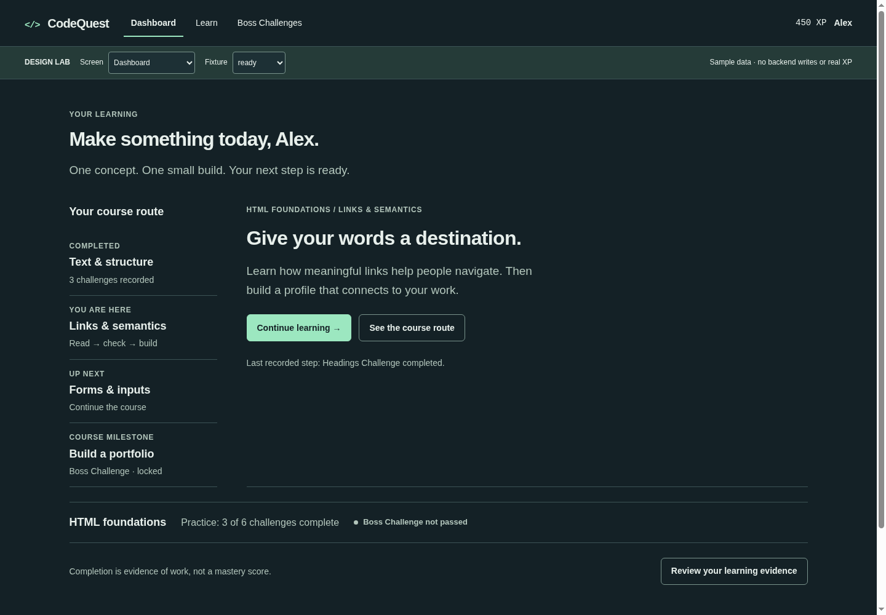 | 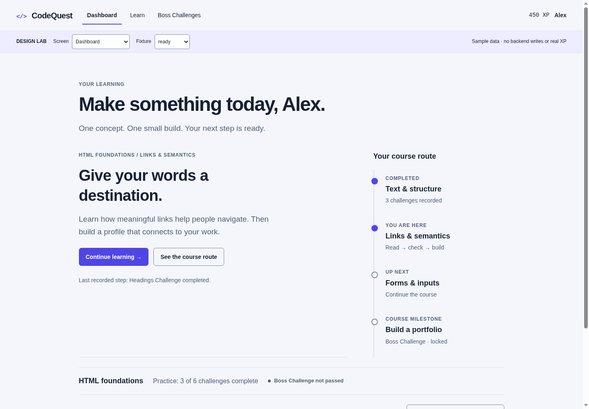 | 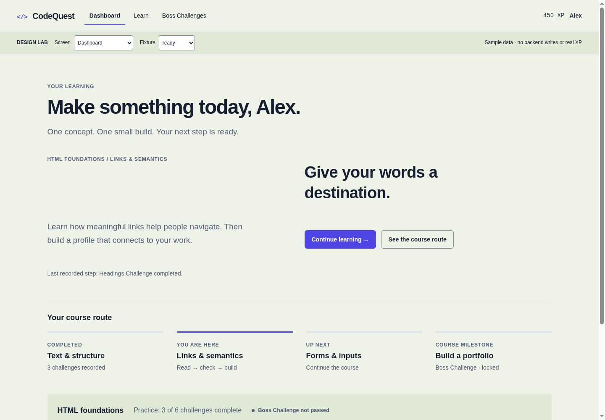 |
| 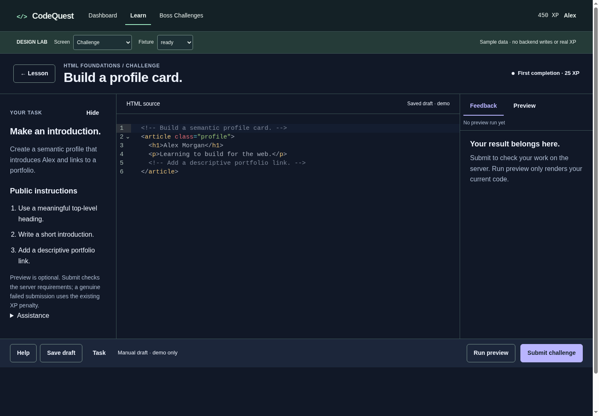 | 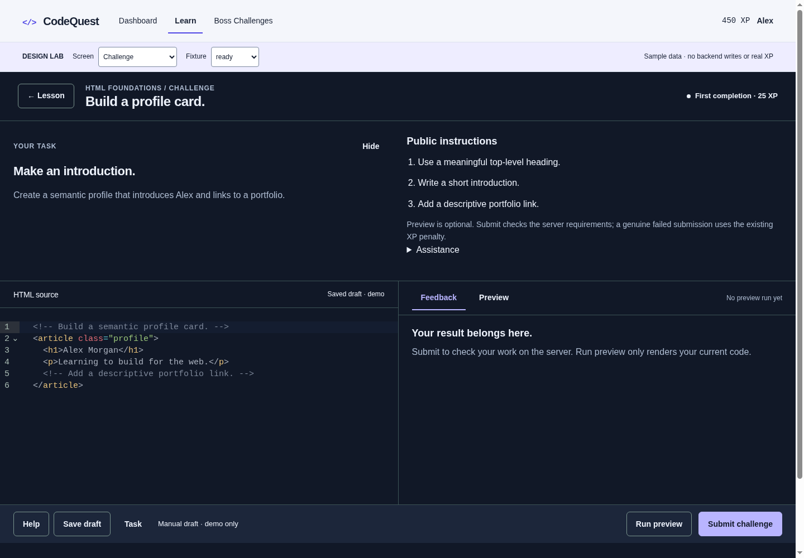 | 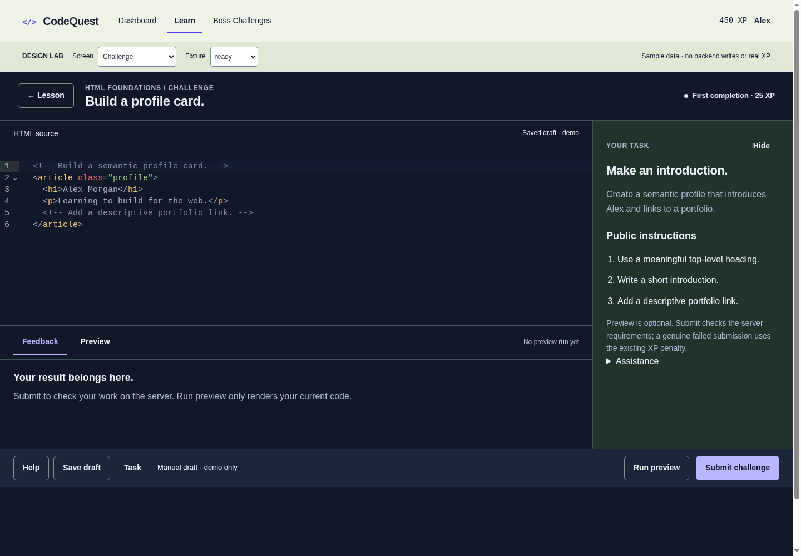 |

### Selected screen evidence

| Screen | Desktop 1440px | Phone 375px |
| --- | --- | --- |
| Dashboard | 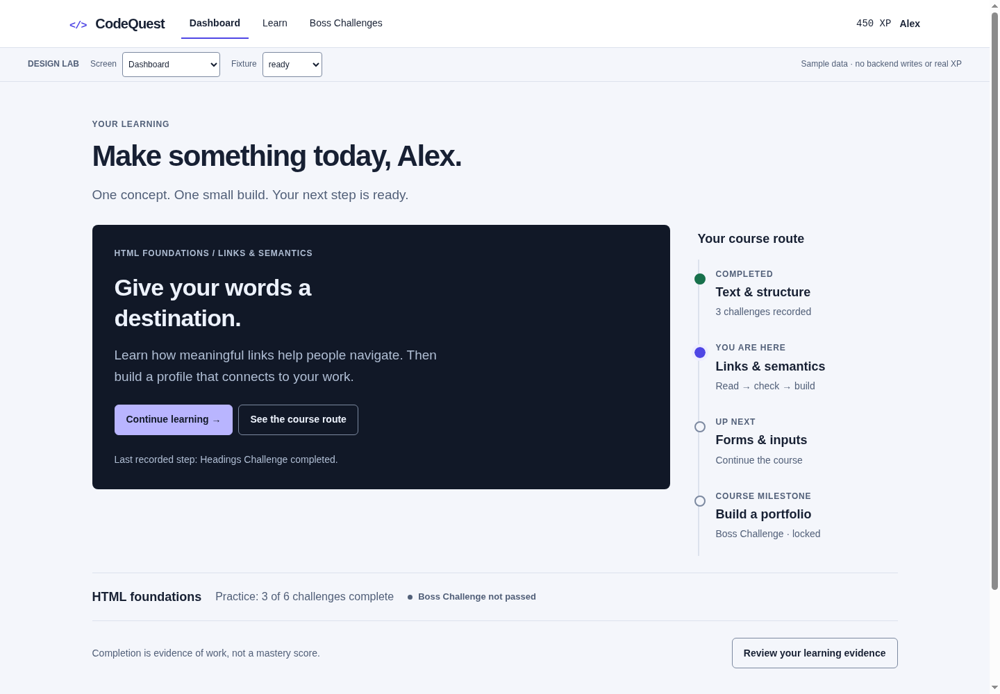 | 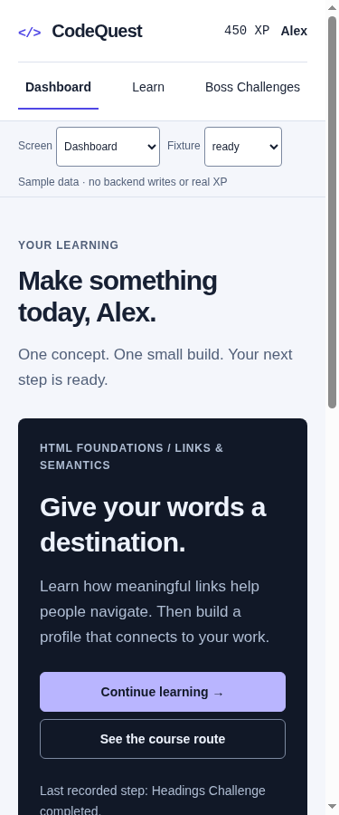 |
| Path | 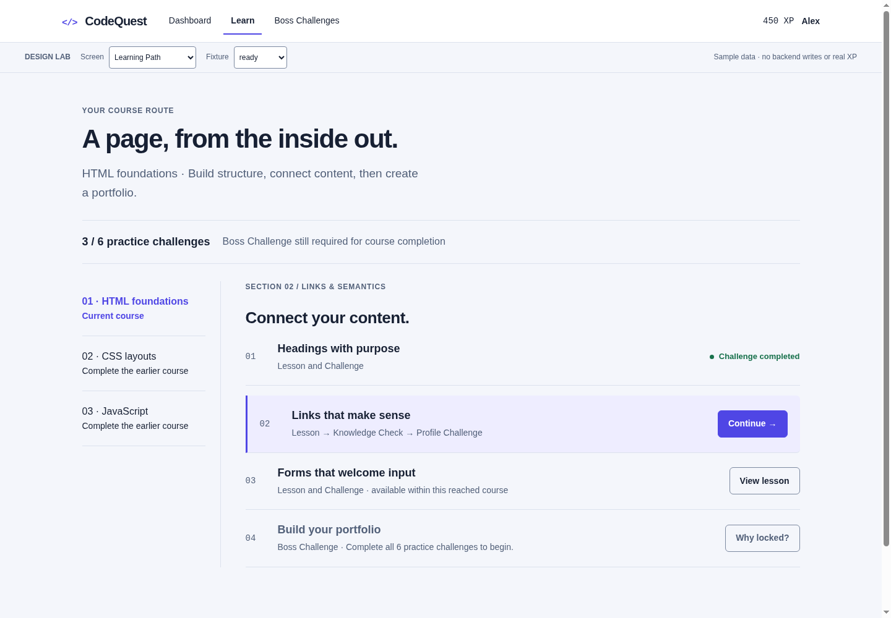 | 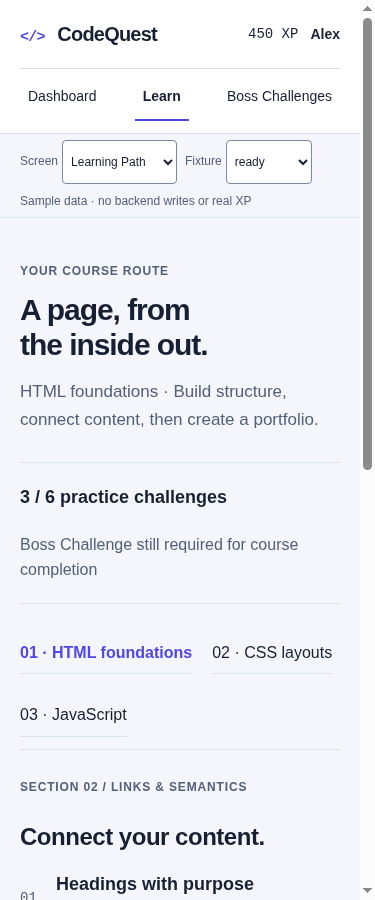 |
| Lesson | 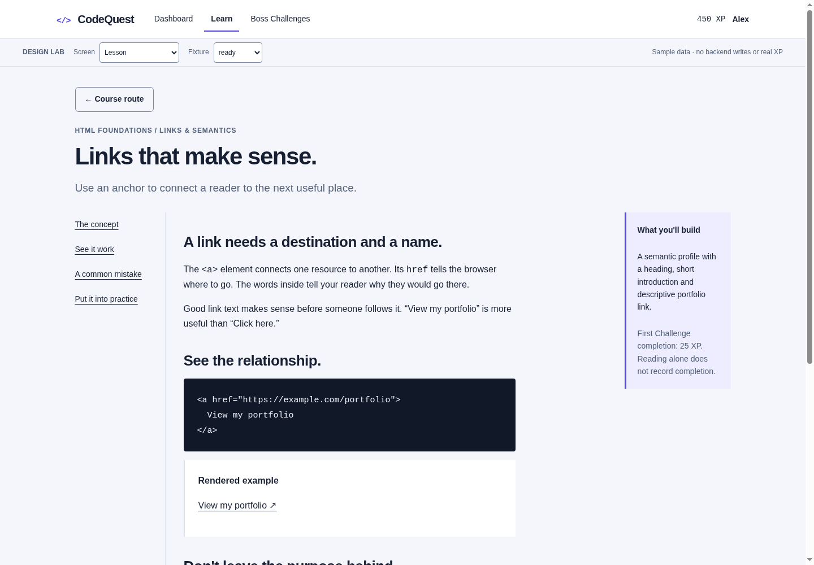 | 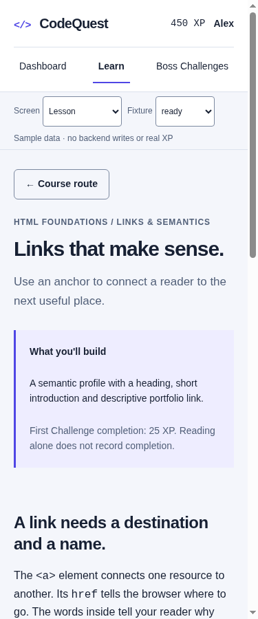 |
| Knowledge Check | 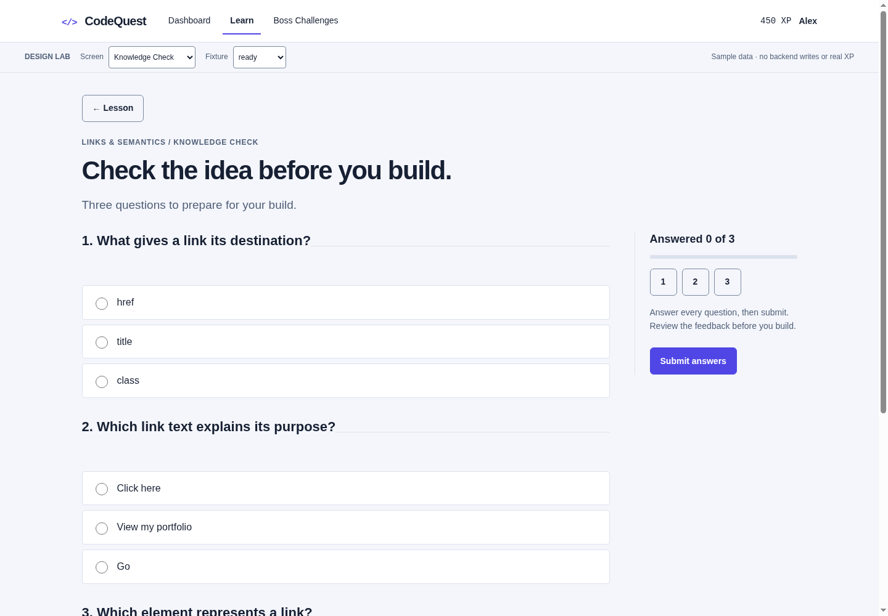 | 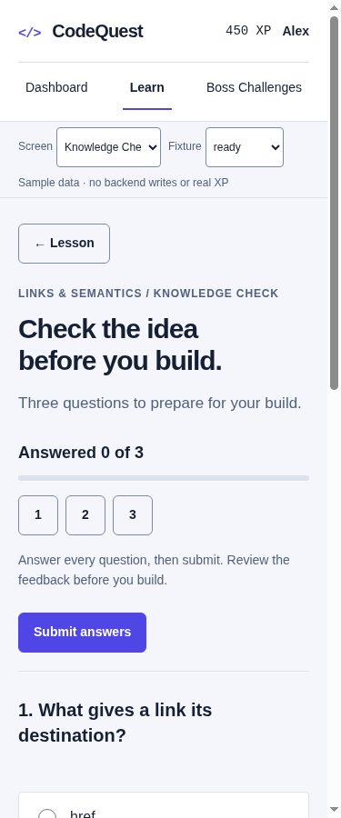 |
| Challenge | 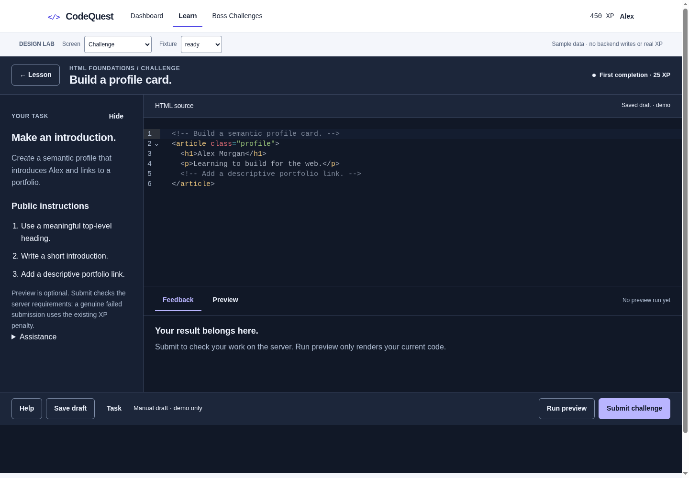 | 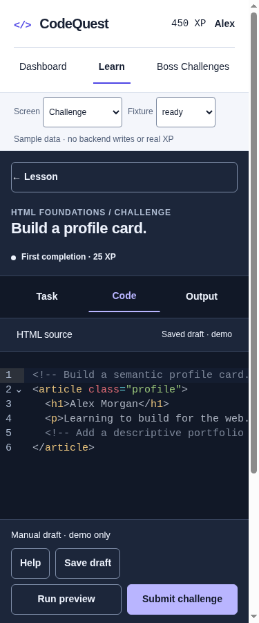 |
| Boss | 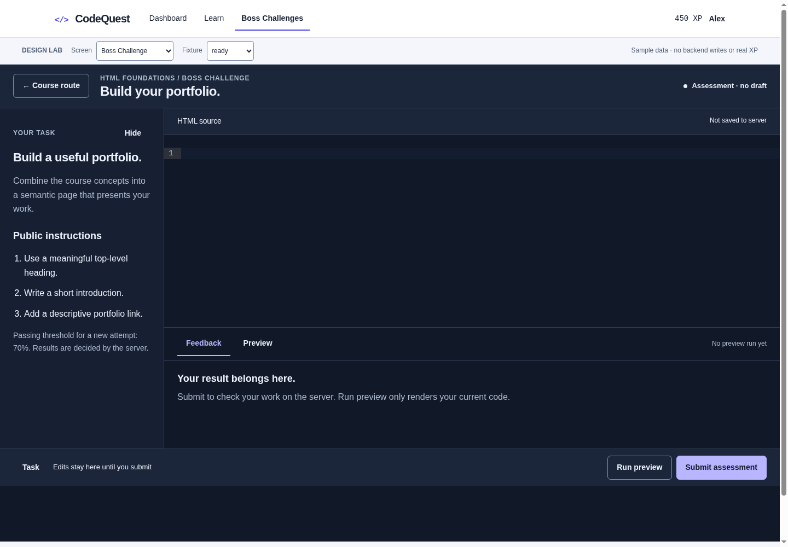 | 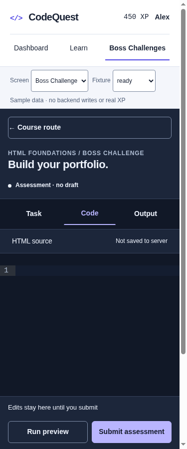 |

768px and 1024px images for all seven screens are retained in the same evidence directory, alongside phone failed/completed/network fixtures and Boss entry/locked captures. Screenshots capture the viewport, not the full scrolling page; an action below the initial fold is not claimed visible from that image alone. The live prototype supports scrolling and interaction.

Iteration history: first captures exposed switcher overlap over mobile Submit and absent Return to Code in Preview. Those were redesigned before final captures. Manual interaction inspection then exposed a delegated-click selector accidentally matching the body theme attribute; it was fixed and checked again. Inspection tooling also needed a navigation wait; that was a harness issue, not a product finding.

### Executed browser verification

The final headless Chromium 154 pass produced [inspection.json](prototype/v2-evidence/inspection.json) and 42 viewport captures. Selected Dashboard, Path, Lesson, Knowledge Check, Challenge, Boss and Progress were exercised at 375, 768, 1024 and 1440px. Additional captures cover the three competing structures and selected recovery/assessment fixtures.

| Check | Executed result |
| --- | --- |
| Page-width overflow | None in all 42 captured configurations; internal editor scrolling is intentional |
| Visible main action targets | All measured at least 44px tall; this measurement excludes text links and CodeMirror internals |
| Desktop editor dominance | Selected Challenge and Boss editor 1125px of a 1425px workspace, approximately 79%; left Task uses the remainder and Output sits below Code |
| Editor/source preservation | Passed mounted-editor pane switching and exact-source sandboxed Run checks |
| Preview/draft clarity | Passed stale-preview edit detection and explicitly demo-only Save acknowledgment |
| Assessment integrity representation | Passed read-only recorded Boss source, absent Save/Help and blank retry checks |
| Knowledge Check recovery | Passed unanswered-question focus and live answered-count checks |
| Keyboard/reflow/motion | Passed arrow navigation, visible focus outline, effective 720px reflow and reduced-motion checks |
| Script errors | No captured runtime errors |

All 12 interaction checks passed. Screenshots were visually inspected during iteration, including final phone failed/passed Boss states; this is not a claim of exhaustive manual inspection of every screenshot. Software-keyboard behavior, screen-reader announcements, forced colors, effective 320px reflow and complete rendered syntax/token contrast remain manual or production acceptance work. No backend tests were run for this isolated experiment; no production behavior was changed.

### Measured color pairs

Opaque token calculations were executed for this revision. Ratios: light text/canvas 15.05:1; supporting text/canvas 5.87:1; white/primary button 6.29:1; control edge/reading surface 3.53:1; warning/canvas 6.10:1; failure/canvas 6.02:1; info/canvas 6.65:1; success/canvas 5.54:1; dark text/canvas 15.80:1; dark supporting/canvas 9.33:1; dark action foreground/background 9.39:1; dark control edge/raised surface 4.57:1. Opaque pairs meet their relevant text or control thresholds. This is not a complete rendered contrast audit; syntax coloring, all hover/disabled pairs and opacity effects still need production measurement.

## 22. Implementation roadmap

| Priority / slice | Work | Exit criterion |
| --- | --- | --- |
| P0 · presentation contracts | Map current continuation, gates, source origin, owned attempts, recorded thresholds and safe outcome categories | No client verdict/progression; available→Begin, terminal stored source, unavailable vs failed, history retained |
| P0 · shared Challenge/Boss workspace | Build both foundations together; editor/fallback, Task, dock, toolbar, shared adapter and read-only evidence | Identical equivalent-mode geometry/actions at all reference widths; no raw Boss srcdoc, state/source loss or unsupported controls |
| P0 · feedback/recovery | Persistent authoritative feedback, exact validation, confirmed draft/help, ambiguous response reconciliation | No optimistic Saved/Passed, automatic POST replay, lost source or detached-only failure |
| P1 · student shell and continuation | Visible mobile destinations and single server next-action projection | Dashboard, Path, Lesson and completion agree on eligible next task |
| P1 · path and reading | Flat course/work hierarchy and bounded article/example flow | No nested card hierarchy, invented sequential locks or reading completion claim |
| P1 · check and evidence | Reuse current answered logic, improve focus/mobile review, correct evidence provenance | Native accessibility retained; actual counts/formulas; no mastery/XP conflation |
| P1 · token ownership | Extract production primitives/semantics/components, migrate prototype CSS import | Built assets verified across student surfaces without affecting role permissions or other shells |
| P2 · broader role design | Teacher scoped roster/attention/drill-down and Admin title/filter/table/row actions | Distinct role composition, shared token semantics, no student milestone aesthetic forced onto monitoring |

Acceptance must cover all four widths, long text, absent content, required/unsubmitted check, all-practice-complete/Boss-unpassed, submitted recovery, prior pass plus failed retry, missing historical snapshot, no-JS/loader failure and unknown transport. Keyboard-only operation, screen reader, software keyboard, measured contrast and effective 320px reflow remain required before production acceptance. Do not broaden testing simply to inflate counts; cover changed authorization/evidence/request boundaries and actual interactions.

This proposal is ready for visual review, not automatic promotion of throwaway code. The first production screens are Challenge and Boss together, then the shell/continuation and connected learning screens. No dependencies, migrations, production data changes, new grading policies or mastery metrics are part of the redesign.
